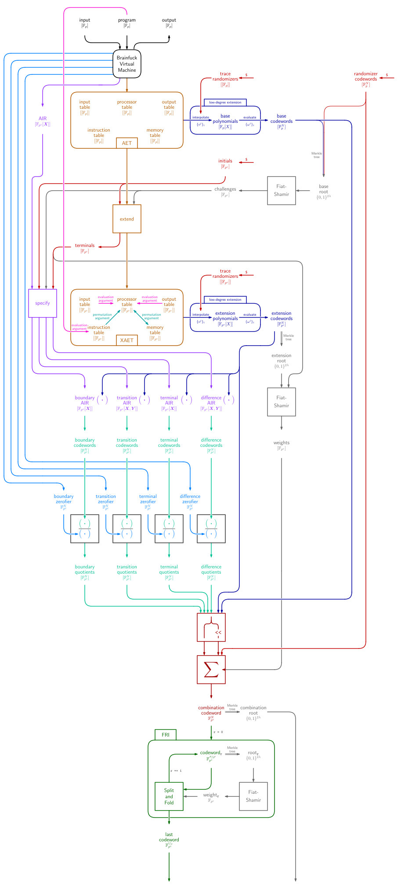

# BrainSTARK, Part III: Arithmetization of Brainfuck VM

The virtual machine defines the evolution of two registers and memory. [Part I](engine) already contains a high-level description of how memory might work. Therefore, let's focus for starters on the evolution of the set of registers in the processor.

Using two registers `ip` and `mp` for instruction pointer and memory pointer like the VM defines makes sense. However, this selection is too limited on its own. The constraints need to depend not just on the index contained in `ip` and `mp`, but also on the values these registers point to. To this end, introduce `mv` (*memory value*) and `ci` (*current instruction*). If the current instruction is a potential jump, then we also need to know where to jump to. This address is contained in the next instruction, and so a register is needed for that purpose: `ni`. Also, a potential jump requires some constraints be enforced if `mv` is nonzero and other constraints be enforced if `mv` is zero. The only way to enforce constraints conditioned on the zero-ness of some variable, is with an expression contains the inverse of this variable if it exists and 0 otherwise. Let `inv` be this register, and so in particular we have that `mv * inv` is always 0 or 1. Lastly, in order to make a permutation argument work for establishing correct memory accesses, it is necessary to keep track of jumps in a cycle counter in the table where the rows are sorted for memory address. To this end, introduce a register `clk` whose only purpose is to count the number of cycles have passed.

So for reference, this is the list of registers in our processor:
 - `clk` – clock, counts the number of cycles that have passed.
 - `ip` – instruction pointer, points to the current instruction in the program.
 - `ci` – current instruction, value of the program at `ip`.
 - `ni` – next instruction, value of the program at location `ip+1` or 0 if out of bounds.
 - `mp` – memory pointer, points to a memory cell.
 - `mv` – memory value, value of the memory pointed at by `mp`.
 - `inv` – inverse, takes the value 0 if `mv` is zero, or the multiplicative inverse of `mv` otherwise.

The processor does not evolve in isolation; rather, it receives an input and produces an output, and it interacts with a program and a memory. These interactions must also be authenticated. Concretely, this means there must be permutation and evaluation arguments between this table, the *Processor Table*, and other Tables.

Specifically:
 - The processor reads from and writes to memory. Whenever the memory pointer `mp` is reset to a prior value, the memory value `mv` must be consistent with the last time this memory cell was set. This consistency is enforced through a permutation argument with the *Memory Table*.
 - The processor reads instructions from a memory-like object that is schematically located in between the processor and the program. On the one hand, a permutation argument establishes that every tuple `(ip, ci, ni)` that the processor ever assumes has a matching row in this *Instruction Table*. On the other hand, an evaluation argument establishes that all rows of this Instruction Table correspond to an instruction and its successor at the given location in the program. The verifier, who has cleartext access to the program, evaluates this terminal locally.
 - The processor reads inputs from a stream of symbols called the Input Table. An evaluation argument establishes that the symbols read by the processor are identical to the symbols that make up the 'input' part of the computational integrity claim.
 - The processor writes outputs to another stream of symbols called the Output Table. An evaluation argument establishes that the symbols written by the processor are identical to the symbols that make up the 'output' part of the computational integrity claim.

This description gives rise to the following diagram representation of the various tables and their interactions. The red arrows denote evaluation arguments; the blue arrows denote permutation arguments.

One feature of this diagram might be confusing. If the verifier has cleartext access to the input and the output, then surely he can compute the evaluation terminals locally without bothering with the InputTable and OutputTable? That observation is entirely correct. However, the motivation for the present architecture is to enable extensions. For instance, a natural extension is for the input to remain secret, or even for the same secret input to be reused in different places within the same proof system, or even across different proofs. For fancier constructions like these, an explicit InputTable comes in handy.

## Tables

The two-stage RAP defines base columns in the first stage, and extension columns in the second stage. In between the verifier supplies uniformly random scalars $a, b, c, d, e, f, \alpha, \beta, \delta, \gamma, \eta$.

### ProcessorTable

The ProcessorTable consists of 7 base columns and 4 extension columns. The 7 base columns correspond to the 7 registers. The 4 extension columns correspond to the 4 table relations it is a party to. The columns may be called `InstructionPermutation`, `MemoryPermutation`, `InputEvaluation`, and `OutputEvaluation`.

The boundary constraints for the base columns require that all registers except for `ci` and `ni` be initialized to zero. For the extension columns, `InstructionPermutation` and `MemoryPermutation` both start with a random initial value selected by the prover, but since this value needs to remain secret it is enforced instead through a difference constraint across tables. The `InputEvaluation` and `OutputEvaluation` columns start with 0 – no need to keep secrets here, and nor are any symbols being read or written.

The transition constraints for the base columns are rather involved because they capture dependence on the instruction. Let $\mathsf{ci}$ be the variable representing the current instruction register `ci` in the current row. Then define the deselector polynomial for symbol a $\varphi \in \Phi = \lbrace$`[`,`]`,`<`,`>`,`+`,`-`,`,`,`.`$\rbrace$ as 
$$\varsigma_\varphi(\mathsf{ci}) = \mathsf{ci} \prod_ {\phi \in \Phi \backslash \varphi} (\mathsf{ci} - \phi) \enspace .$$
It evaluates to zero and in any instruction that is not $\varphi$, but to something nonzero in $\varphi$. The utility of this deselector polynomial stems from the fact that it renders conditionally inactive any AIR constraint it is multiplied with – conditionally being whenever the current instruction is different from $\varphi$. This allows us to focus on the AIR transition constraints *assuming* the given instruction, and then multiply whatever we come up with with this deselector polynomial in order to deactivate it whenever the assumption is false.

Another useful trick is to describe the transition constraints in [disjunctive normal form](https://en.wikipedia.org/wiki/Disjunctive_normal_form), also known as OR-of-ANDs. This form is useful because an OR of constraints corresponds to a multiplication of constraint polynomials.

With these tricks in mind, let's find AIR transition constraints for each instruction. Let $\mathsf{clk}, \mathsf{ip}, \mathsf{ci}, \mathsf{ni}, \mathsf{mp}, \mathsf{mv}, \mathsf{inv}, \mathsf{clk}^\star, \mathsf{ip}^\star, \mathsf{ci}^\star, \mathsf{ni}^\star, \mathsf{mp}^\star, \mathsf{mv}^\star, \mathsf{inv}^\star$ be the variables that capture two consecutive rows of base columns. Let furthermore $\mathsf{is\_zero}$ be shorthand for the expression $1 - \mathsf{mv} \cdot \mathsf{inv}$, which takes the value 1 whenever $\mathsf{mv}$ is zero and 0 otherwise.
 - $\mathsf{ci} =$ `[`:
   - jump if $\mathsf{mv} = 0$ and skip two otherwise: $(\mathsf{ip}^\star - \mathsf{ip} - 2) \cdot \mathsf{mv} + (\mathsf{ip}^\star - \mathsf{ni}) \cdot \mathsf{is\_zero}$
   - memory pointer remains: $\mathsf{mp}^\star - \mathsf{mp}$
   - memory value remains: $\mathsf{mv}^\star - \mathsf{mv}$
 - $\mathsf{ci} = $ `]`:
   - jump if $\mathsf{mv} \neq 0$ and skip two otherwise: $(\mathsf{ip}^\star - \mathsf{ip} - 2) \cdot \mathsf{is\_zero} + (\mathsf{ip}^\star - \mathsf{ni}) \cdot \mathsf{mv}$
   - memory pointer remains: $\mathsf{mp}^\star - \mathsf{mp}$
   - memory value remains: $\mathsf{mv}^\star - \mathsf{mv}$
 - $\mathsf{ci} = $ `<`:
   - instruction pointer increments by one: $\mathsf{ip}^\star - \mathsf{ip} - 1$
   - memory pointer decrements by one: $\mathsf{mp}^\star - \mathsf{mp} + 1$
   - memory value is unconstrained.
 - $\mathsf{ci} = $ `>`:
   - instruction pointer increments by one: $\mathsf{ip}^\star - \mathsf{ip} - 1$
   - memory pointer increments by one: $\mathsf{mp}^\star - \mathsf{mp} - 1$
   - memory value is unconstrained.
 - $\mathsf{ci} = $ `+`:
   - instruction pointer increments by one: $\mathsf{ip}^\star - \mathsf{ip} - 1$
   - memory pointer remains: $\mathsf{mp}^\star - \mathsf{mp}$
   - memory value increments by one: $\mathsf{mv}^\star - \mathsf{mv} - 1$.
 - $\mathsf{ci} = $ `-`:
   - instruction pointer increments by one: $\mathsf{ip}^\star - \mathsf{ip} - 1$
   - memory pointer remains: $\mathsf{mp}^\star - \mathsf{mp}$
   - memory value decrements by one: $\mathsf{mv}^\star - \mathsf{mv} + 1$.
 - $\mathsf{ci} = $ `,`:
   - instruction pointer increments by one: $\mathsf{ip}^\star - \mathsf{ip} - 1$
   - memory pointer remains: $\mathsf{mp}^\star - \mathsf{mp}$
   - memory value is unconstrained.
 - $\mathsf{ci} = $ `.`:
   - instruction pointer increments by one: $\mathsf{ip}^\star - \mathsf{ip} - 1$
   - memory pointer remains: $\mathsf{mp}^\star - \mathsf{mp}$
   - memory value remains: $\mathsf{mv}^\star - \mathsf{mv}$.

These are the constraints that vary depending on the instruction. They should each be multiplied by their corresponding instruction deselector. And after that multiplication, the polynomials can be summed together – as long as each sum consists of exactly one term for every instruction. The result is three constraint polynomials.

In addition to the above, there are polynomials that do not depend on the current instruction. They are:
 - clock increases by one: $\mathsf{clk}^\star - \mathsf{clk} - 1$.
 - inverse is the correct inverse of the memory value (A): $\mathsf{inv} \cdot (1 - \mathsf{inv} \cdot \mathsf{mv})$
 - inverse is the correct inverse of the memory value (B): $\mathsf{mv} \cdot (1 - \mathsf{inv} \cdot \mathsf{mv})$.

Those are the transition constraints for the base columns. Next up are the transition constraints for the extension columns. To this end the weights $d, a, b, c, e, f$ are assigned to the first six columns; any selection of columns thereby generates a sum with consistent weights. The evaluation and permutation arguments apply to a single virtual column, which in reality is a weighted sum of selected columns. Let $\mathsf{ipa}, \mathsf{mpa}, \mathsf{iea}, \mathsf{oea}$ be the variables in the current for for the instruction permutation argument, memory permutation argument, input evaluation argument, output evaluation argument, respectively, and $\mathsf{ipa}^\star, \mathsf{mpa}^\star, \mathsf{iea}^\star, \mathsf{oea}^\star$ their counterparts for the next row.

 - The instruction permutation argument: applies to columns $\mathsf{ip}$, $\mathsf{ci}$ and $\mathsf{ni}$. Every next element accumulates one factor, but only if the current row is not a padding row because then it remains the same: $\mathsf{ci} \cdot ( \mathsf{ipa} \cdot (a \cdot \mathsf{ip} + b \cdot \mathsf{ci} + c \cdot \mathsf{ni} - \alpha) - \mathsf{ipa}^\star) + (\mathsf{ipa}^\star - \mathsf{ipa}) \cdot \prod_{\varphi \in \Phi} (\mathsf{ci} - \varphi)$.
 - The memory permutation argument: applies to columns $\mathsf{clk}, \mathsf{mp}, \mathsf{mv}$. Every next element accumulates one factor: $\mathsf{mpa} \cdot (d \cdot \mathsf{clk} + e \cdot \mathsf{mp} + f \cdot \mathsf{mv} - \beta) - \mathsf{mpa}^\star$.
 - The input evaluation argument applies to just one column ($\mathsf{mv}$) so the weight is superfluous. The constraint stipulates that the running sum accumulates a term whenever $\mathsf{ci} = $ `,` and remains intact otherwise: $\varsigma_{','}(\mathsf{ni}) \cdot (\mathsf{iea} \cdot \gamma + \mathsf{mv}) + (\mathsf{ni} - ',') \cdot \mathsf{iea} - \mathsf{iea}^\star$.
 - The output evaluation argument is analogous to the input evaluation argument except that the relevant instruction is `.` rather than `,`. The constraint stipulates that the running sum accumulates a term whenever $\mathsf{ci} = $ `.` and remains intact otherwise: $\varsigma_{'.'}(\mathsf{ni}) \cdot (\mathsf{oea} \cdot \delta + \mathsf{mv}) + (\mathsf{ni} - '.') \cdot \mathsf{oea} - \mathsf{oea}^\star$.

The Processor Table has four table relation arguments and so the prover supplies the verifier with four terminals, $T_{\mathsf{ipa}}, T_{\mathsf{mpa}}, T_{\mathsf{iea}}, T_{\mathsf{oea}}$. These terminal values determine terminal constraints, which apply in the last row of extension columns.
 - For the instruction permutation argument, the last row is the only row that was not accumulated into the running product: $\mathsf{ipa} \cdot (a \cdot \mathsf{ip} + b \cdot \mathsf{ci} + c \cdot \mathsf{ni} - \alpha) - T_{\mathsf{ipa}}$.
 - For the memory permutation argument, once again the last row is the only row that was not accumulated into the running product: $\mathsf{mpa} \cdot (d \cdot \mathsf{clk} + e \cdot \mathsf{mp} + f \cdot \mathsf{mv} - \beta) - T_{\mathsf{mpa}}$.
 - For the input evaluation argument, the last element is identical to the terminal: $\mathsf{iea} - T_{\mathsf{iea}}$.
 - For the output evaluation argument, the last element is likewise identical to the terminal: $\mathsf{oea} - T_{\mathsf{oea}}$.

### Instruction Table

The Instruction Table contains more rows than the Processor Table. It contains one row for every row in the Processor Table, in addition to one row for every instruction in the program. The rows are sorted by instruction address, except for the rows that were added for padding. It has 3 base columns: $\mathsf{ip}, \mathsf{ci}, \mathsf{ni}$, and 2 extension columns: $\mathsf{ppa}$ (processor permutation argument) and $\mathsf{pea}$ (program evaluation argument). The base columns are weighted with $a, b, c$ and the extension columns operate relative to $\alpha$ and $\eta$ respectively.

There is only one boundary constraint that applies to the base columns: $\mathsf{ip}$ (<–– that's the constraint polynomial), which enforces that the instruction pointer starts with zero. In terms of extension columns, the initial value of $\mathsf{ppa}$ is constrained by a difference constraint but not by a boundary constraint. The initial value of $\mathsf{pea}$ should be equal to the appropriately weighted sum: $a \cdot \mathsf{ip} + b \cdot \mathsf{ci} + c \cdot \mathsf{ni} - \mathsf{pea}$.

There are four transition constraints that apply to the base columns:
 - The instruction pointer increases by one or not at all: $(\mathsf{ip}^\star - \mathsf{ip}) \cdot (\mathsf{ip}^\star - \mathsf{ip} - 1)$.
 - If the instruction pointer does increase by one, then the next instruction of the current row has to be equal to the current instruction of the next row: $(\mathsf{ip}^\star - \mathsf{ip}) \cdot (\mathsf{ni} - \mathsf{ci}^\star)$.
 - If the instruction pointer remains the same, then so does the current instruction: $(\mathsf{ip}^\star - \mathsf{ip} - 1) \cdot (\mathsf{ci}^\star - \mathsf{ci})$.
 - If the instruction pointer remains the same, then so does the next instruction: $(\mathsf{ip}^\star - \mathsf{ip} - 1) \cdot (\mathsf{ni}^\star - \mathsf{ni})$.

The second bullet point is redundant because it is implied by the evaluation argument. Speaking of which – the extension columns evolve in accordance with the permutation and evaluation arguments:
 - The permutation argument accumulates one factor in every row if the row is not padding and if the instruction pointer does not increase. Otherwise it remains the same. This gives rise to a sum of three separate constraints. Recall that in padded rows, $\mathsf{ci} = 0$.
   - $\mathsf{ci} \cdot (\mathsf{ip} + 1 - \mathsf{ip}^\star) \cdot (\mathsf{ppa}^\star - \mathsf{ppa} \cdot (a \cdot \mathsf{ip}^\star + b \cdot \mathsf{ci}^\star + c \cdot \mathsf{ni}^\star - \alpha))$
   - $\left( \prod_{\varphi \in \Phi} \mathsf{ci} - \varphi \right) \cdot (\mathsf{ppa}^\star - \mathsf{ppa})$ with $\Phi =$ {`[`, `]`, `<`, `>`, `+`, `-`, `,`, `.`}
   - $(\mathsf{ip} - \mathsf{ip}^\star) \cdot (\mathsf{ppa}^\star - \mathsf{ppa})$
 - The evaluation argument accumulates a term in every row that follows a change in $\mathsf{ip}$, and remains the same in every row that does not. This constraint is separable into two terms:
   - $(\mathsf{ip}^\star - \mathsf{ip} - 1) \cdot (\mathsf{pea}^\star - \mathsf{pea} )$
   - $(\mathsf{ip}^\star - \mathsf{ip}) \cdot (\mathsf{pea}^\star - \mathsf{pea} \cdot \eta - (a \cdot \mathsf{ip}^\star + b \cdot \mathsf{ci}^\star + c \cdot \mathsf{ni}^\star))$.

There are two terminals, one for each extension column. The terminal for the processor permutation argument coincides with the terminal for the instruction permutation argument in the ProcessorTable, $T_{\mathsf{ppa}} = T_{\mathsf{ipa}}$, and is sent by the prover. The terminal for the evaluation argument, $T_{\mathsf{pea}}$ is computed locally by the verifier. These terminals give rise to the following terminal constraints:
 - The processor permutation argument has accumulated all rows: $\mathsf{ppa} - T_{\mathsf{ppa}}$.
 - The program evaluation argument has also accumulated all rows: $\mathsf{pea} - T_{\mathsf{pea}}$.

### Memory Table

The Memory Table consists of three base columns, $\mathsf{clk}$, $\mathsf{mp}$, and $\mathsf{mv}$, and one extension column $\mathsf{ppa}$ that computes the permutation argument relating the Memory Table to the Processor Table. It uses $d, e, f$ as verifier-supplied weights for the base column and a running product relative to $\beta$.

The rows of the Memory Table are sorted by memory pointer $\mathsf{mp}$ and then by cycle $\mathsf{clk}$. With this order, gaps in cycle count indicate returning to a previously visited memory cell. These return events are precisely the locations where memory consistency should be enforced.

The boundary constraints for the base columns are $\mathsf{clk} = \mathsf{mp} = \mathsf{mv} = 0$ in the first row. The extnesion column is unconstrained in the first row, because this value should be the secret random initial.

The transition constraints that apply to the base columns are as follows.
 - The memory pointer increases by one or remains the same: $(\mathsf{mp} + 1 - \mathsf{mp}^\star) \cdot (\mathsf{mp} - \mathsf{mp}^\star)$.
 - If the memory pointer increases by one, then the new memory value must be zero: $(\mathsf{mp} - \mathsf{mp}^\star) \cdot \mathsf{mv}^\star$.
 - If a) the memory pointer does not change; and b) the cycle count increases by one, then c) the memory value may change. This constraint requires two separate polynomials:
   - $(\mathsf{mp} - \mathsf{mp}^\star) \cdot (\mathsf{mv}^\star - \mathsf{mv})$
   - $(\mathsf{clk} - 1 - \mathsf{clk}^\star) \cdot (\mathsf{mv}^\star - \mathsf{mv})$.

The extension column $\mathsf{ppa}$ computes a running product in line with a straightforward permutation argument. In every consecutive pair of rows, the previous row, weighted by $d, e, f$ for columns $\mathsf{clk}, \mathsf{mp}, \mathsf{mv}$ respectively, is accumulated into the next row's running product: $\mathsf{ppa} \cdot (d \cdot \mathsf{clk} + e \cdot \mathsf{mp} + f \cdot \mathsf{mv} - \beta) - \mathsf{ppa}^\star$.

The table has one terminal, $T_{\mathsf{ppa}}$, which coincides with the $T_{\mathsf{mpa}}$ terminal for the Processor Table and which is sent by the prover. It defines a terminal constraint, which enforces the notion that the running product has accumulated all rows but the last: $\mathsf{ppa} \cdot (d \cdot \mathsf{clk} + e \cdot \mathsf{mp} + f \cdot \mathsf{mv} - \beta) - T_{\mathsf{ppa}}$.

### Input and Output Tables

The Input Table and the Output Table are analogous; both are specializations of a more general *IO Table*. The differences, as far as this section is concerned, is the challenge with respect to which the evaluation argument is made: for the Input Table it is $\gamma$ whereas for the Output Table it is $\delta$. The terminal is *not* sent by the prover but computed by the verifier from the input and output.

Let $\mathsf{c}$ denote the base column and $\mathsf{ea}$ the extension column. The challenge $\zeta$ refers to either $\gamma$ or $\delta$.

The boundary constraint applies only to the extension column and stipulates that running sum starts with the column element: $\mathsf{ea} - \mathsf{c}$.

The transition constraint applies the multiply-and-add rule of evaluation arguments: $\zeta \cdot \mathsf{ea} + \mathsf{c}^\star - \mathsf{ea}^\star$.

The terminal constraint, which is relative to the terminal $T_{\mathsf{ea}}$, stipulates that the final running evaluation takes this value: $T_{\mathsf{ea}} - \mathsf{ea}$.

## Difference Constraints

There are two permutation arguments concerning columns that should remain hidden if the STARK proof should achieve zero-knowledge. But the permutation argument yields the value of a polynomial determined by the columns in question, so clearly the terminal value of this permutation argument leaks information.

To avoid this, the first value of the extension columns that compute these permutation arguments is set by the prover to a random inital value. Accordingly, there is no boundary constraint that constrains these columns' initial values. Columns of different tables that compute the same permutation argument start with the same initial. As a result, the terminal is uniformly random and leaks no information about the column without damaging the soundness of the permutation argument.

It is still necessary to establish that the columns in question do in fact start with the same value. Difference constraints achieve this.

Specifically, column $\mathsf{ipa}$ of the Processor Table and column $\mathsf{ppa}$ of the Instruction Table compute matching permutation arguments. The interpolants of these columns, $f_{\mathsf{ipa}}(X)$ and $f_{\mathsf{ppa}}(X)$ evaluate to the same initial in $X = \omicron^0 = 1$. Therefore, the polynomial $f_{\mathsf{ipa}}(X) - f_{\mathsf{ppa}}(X)$ must evaluate to 0 in $X=1$. Phrased differently, this difference polynomial must be divisible by $X-1$. The resulting *difference quotient* must be proven to have degree bounded by $\max(\deg(f_{\mathsf{ipa}}(X)), \deg(f_{\mathsf{ppa}}(X))) - 1$ and to this end the quotient is added to the nonlinear combination.

Likewise, the column $\mathsf{mpa}$ of the Processor Table and the column $\mathsf{ppa}$ of the Memory Table compute the same permutation argument and so start with the same initial. Therefore, the prover should additionally establish that $\frac{f_{\mathsf{mpa}}(X) - f_{\mathsf{ppa}}(X)}{X-1}$ has degree bounded by $\max(\deg(f_{\mathsf{mpa}}(X)), \deg(f_{\mathsf{ppa}}(X))) - 1$.

## Picture

Credit goes to [Ferdinand](https://github.com/jan-ferdinand) for producing the following diagram overview of the proof generation pipeline.

| Next up: [Part IV: Next Steps](next) |
|-|
| [0](index) - [1](engine) - [2](brainfuck) - **3** - [4](next) |