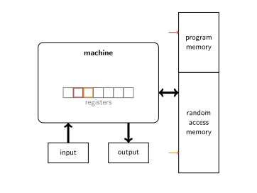

# BrainSTARK, Part I: STARK Engine

## STARK Recap

The word STARK can mean one of several things.

 - STARK $_1$: The acronym stands for Scalable Transparent ARgument of Knowledge, which applies to any SNARK (or even interactive SARK) has at most a polylogarithmic prover overhead and no trusted setup.
 - STARK $_2$: A specific way of building STARK $_1$'s by using AETs and AIRs and plugging the resulting polynomials into FRI to prove their bounded degree.
 - STARK $_3$: a concrete proof object resulting from a STARK $_2$ prover.

This short review focuses on STARK $_2$.

### AIR and AET

At the heart of a STARK is the Algebraic Execution Trace (AET), which is a table of $\mathsf{w}$ columns and $T+1$ rows. Every column tracks the value of one register across time. Every row represents the state of the entire machine at one point in time. There are $T+1$ rows because the machine was initialized to the initial state before it was run for $T$ time steps.

The AET is *integral* if all Arithmetic Intermediate Representation (AIR) constraints are satisfied. These constraints come in several classes.

 - Boundary constraints apply only at the beginning or at the end. Boundary constraints are represented as polynomials in $\mathsf{w}$ variables. Boundary constraints enforce, for instance, that the initial state is correct.
 - Transition constraints apply to every consecutive pair of rows, and can be represented as polynomials in $2\mathsf{w}$ variables. They enforce that the state transition function was evaluated correctly.

While the AIR constraints can be represented as multivariate polynomials, it helps to think of them as maps $\mathbb{F}^{\mathsf{w}} \rightarrow \mathbb{F}$ or $\mathbb{F}^{2\mathsf{w}} \rightarrow \mathbb{F}$. This perspective extends the evaluation map from vectors of $\mathsf{w}$ or $2\mathsf{w}$ field elements to vectors of as many codewords or polynomials.

The prover runs a polynomial interpolation subprocedure to find, for every column, the unique polynomial of degree $T$ that takes the value $i$ rows down in the point $\omicron^i$, where $\omicron$ is a generator of a subgroup of order $T+1$. These polynomials are called the trace polynomials.

Evaluating the AIR constraints in the trace polynomials gives rise to *boundary* and *transition polynomials*. Moreover, every AIR constraint defines a support domain $D \subset \langle \omicron \rangle$ of points where it applies, and with it a zerofier $Z(X)$, which is the unique monic polynomial of degree $|D|$ that evaluates to zero on all of $D$ and no-where else. If the AET satisfies the AIR constraint then this zerofier divides the boundary or transition polynomial cleanly; if the AET does not satisfy the AIR constraint then this division has a nonzero remainder.

The prover continues with the *quotient polynomials* of the previous step. Specifically, he wishes to establish their bounded degree. If the AET satisfies the AIR constraints, then the quotient polynomials will be of low degree. If the AET does not satisfy the AIR constraints the malicious prover might be able to find impostor polynomials that agree with the division relation in enough points, but the point is that this impostor polynomial will necessarily have a *high* degree. And then the prover will fail to prove that its degree is low.

### Commitment

The prover commits to these polynomials as follows. First he evaluates them on a coset of the subgroup spanned by $\Omega$, whose order is $N > T+1$. This process of evaluation gives rise to Reed-Solomon codewords of length $N$. Next, a Merkle tree of this codeword is computed. The root is the commitment to the polynomial, and it is sent to the verifier.

One obvious optimization is available at this point. It is possible to zip the codewords before computing Merkle trees. In fact, after zipping, only one Merkle tree needs to be computed. The leafs of this Merkle tree correspond to tuples of field elements.

The next step is to combine the polynomials' codewords into one codeword using random weights from the verifier. For every quotient polynomial $q_i(X)$, there is a degree bound $b_i$ originating from the known trace length $T$ and AIR constraint degree. The prover combines the nonlinear combination
$$ \sum_{i=0} \alpha_i \cdot q_i(X) + \beta_i \cdot X^{\mathsf{d} - b_i} \cdot q_i(X) \enspace ,$$
where the weights $\alpha_i$ and $\beta_i$ are provided by the verifier, and where $\mathsf{d}$ is the maximum degree bound provably be FRI. The codeword associated with this polynomial is the input to FRI.

### FRI

FRI establishes that the input codeword has a low-degree defining polynomial. It does this by folding the working codeword in on itself using a random weight supplied by the verifier, over the course of several rounds. This folding procedure sends low-degree codewords to low-degree codewords, and high-degree codewords to high-degree codewords. The verifier checks the correct folding relation by inspecting the codewords in a series of indices.

Rather than transmitting the codewords in the clear, the prover first compresses them using a Merkle tree, and then transmits only the root. After all the Merkle roots are in, the verifier announces the indices where he would like to inspect the committed codewords. The prover answers by sending the indicated leafs along with their authentication paths.

In the last round, the prover sends the codeword in the clear. The length of this codeword is what happens after $\mathsf{r}$ halvings – specifically, its length is $N/2^{\mathsf{r}}$, where $N$ as the length of the original codeword.

## From STARK to STARK Engine

The STARK mechanics described above suffice for proving the integral evolution of a *simple* state, *i.e.,* on that is fully determined by $\mathsf{w}$ registers. It suffices for a digital signature scheme based on a proof of knowledge of a preimage under a hash function, or a verifiable delay function. But there is a considerable gap between that and a general-purpose virtual machine.

For instance, a machine following the [von Neumann architecture](https://en.wikipedia.org/wiki/Von_Neumann_architecture) needs to
 1. read the next instruction from memory and decode it;
 2. (possibly) read a word from memory or standard input;
 3. update the register set in accordance with the instruction;
 4. (possibly) write a word to memory or standard output.

 

At best, the simple state evolution descibes the evolution of the machine's register set, which takes place inside the processor. But how does the processor interact with external data sources and sinks? More importantly, how to prove and verify the integrity of these interactions?

## Tables

Let's use as an illustrative example the case where the processor writes something to RAM and then later reads it. To define this interaction with the fewest superfluous components, we need three registers:
 - The cycle counter register `clk` whose value increases by one in every cycle.
 - The memory pointer register `mp` whose value represents an address in RAM.
 - The memory value register `mv` whose value corresponds to the value of the RAM at the address `mp`.

Note that this simple register set does not contain a register for the current instruction. In reality the interactions with the RAM are only necessary if the instruction pertains to it -- specifically, if it is a read or write instruction. We will need to add a register to this effect in order for the instruction set to be capable of doing other things beyond reading from and writing to RAM. For the time being we can tolerate this omission by requiring that the value of `mv` corresponds to the RAM at location `mp` in *every* cycle, even cycles where the instruction has nothing to do with memory. Whenever `mp` changes, `mv` automatically changes also.

The execution trace illustrates two of the problems we want to address.

| `clk` | `mp` | `mv` |
|-------|------|------|
| 0 | 0 | 0 | 
| 1 | 0 | 5 | 
| 2 | 1 | 0 | 
| 3 | 0 | 5 |

The entire RAM is initialized to zero. At the start of the computation, `mp` is set to zero as well. In cycle 1, the memory cell at location 0 (because `mp`=0) is set to 5.  In cycle 2, the memory pointer is set to 1, and the memory value register assumes the value of the RAM at this location, which happens to be zero. In cycle 3, the memory point is set back to 0, and the memory value register assumes the value of the RAM at this location, which now turns out to be 5 because it was set to this value in cycle 1.

The two problems we wish to address are these:
 1. The initial value of all memory cells is zero, but these memory cells can be accessed in the middle of an execution trace. In this trace, there is nothing 'initial' about the initial value of memory cells and in particular there is no boundary constraint that can be enforced at a fixed location.
 2. When the memory pointer register `mp` is reset to a previous value, the memory value register `mv` changes. Its new value now must be consistent with the value it had the last time the memory pointer pointed to it. This constraint pertains to two rows, but the problem is that these two rows are generally not consecutive and not even spaced apart by a static amount. Transition constraints can only apply to *consecutive* pairs of rows.

Notice how both of these issues can be solved through traditional transition constraints if only the table's rows were sorted not by clock cycle but by memory pointer first and then clock cycle. In that case we would have this table:

| `clk` | `mp` | `mv` |
|-------|------|------|
| 0 | 0 | 0 | 
| 1 | 0 | 5 | 
| 3 | 0 | 5 |
| 2 | 1 | 0 | 

The transition constraints that enforce the issues raised above can now be articulated.
 - Whenever the memory pointer `mp` changes, the new memory value `mv` is zero.
 - Whenever memory pointer `mp` is unchanged and the clock cycle `clk` jumps by more than one, the memory value `mv` cannot change.

The STARK prover obviously cannot commit to this table instead of the one sorted by cycle count because doing so would undermine the transition constraints that enforce the correct evolution of the register set through time. It seems as though we have to choose: we can *either* enforce the correct evolution of the register set through time, *or* the consistency of RAM accesses.

The solution is for the prover to commit to both tables. The verifier verifies two sets of AIR constraints, one for the processor table and one for the memory table. But one question remains: how does the verifier verify that these tables pertain to the same execution trace? A *permutation argument* is what establishes that the set of rows of the two tables are identical.

### Permutation Arguments

Without loss of generality, we can assume that the prover has access to random scalars $a, b, c, ...$ supplied by the verifier. The prover can use these scalars to compress multiple columns into one, simply by taking a weighted vectorial sum. The verifier uses the same scalars to compute the same weighted sum in select coordinates but obviously never accesses the entire vector.

Both tables are now reduced to a single column each. Let the elements in these columns be $(c_i)_i$ and $(k_i)_i$. The claim is that the only difference is the order, and that as sets $\{c_i\}_i = \{k_i\}_i$. Let $\alpha$ be another random scalar supplied by the verifier. Both tables, which are now reduced to a single column each, are extended with a new column that computes the products $\prod_i (\alpha - c_i)$ and $\prod_i (\alpha - k_i)$, respectively, by integrating a new factor $\alpha - c_i$ or $\alpha - k_i$ into a running product in each row. Specifically, the transition constraint for this extension column is $\forall i > 0: e_{i-1} \cdot (\alpha - c_{i}) = e_{i}$ (and analogously for the other table), where $e_i$ represents the value from the extension column.

| $c_i$ | $e$ |
|-------|-----|
| $w$ | $\alpha - w$ |
| $x$ | $(\alpha - w)(\alpha - x)$ |
| $y$ | $(\alpha - w)(\alpha - x)(\alpha - y)$ |
| $z$ | $(\alpha - w)(\alpha - x)(\alpha - y)(\alpha - z)$ |

| $k_i$ | $e$ |
|-------|-----|
| $x$ | $\alpha - x$ |
| $y$ | $(\alpha - x)(\alpha - y)$ |
| $w$ | $(\alpha - x)(\alpha - y)(\alpha - w)$ |
| $z$ | $(\alpha - x)(\alpha - y)(\alpha - w)(\alpha - z)$ |

If the two columns really do contain the same values but in a different order, then the products should be the same:
$$ \prod_i (\alpha - c_i) = \prod_i (\alpha - k_i) \enspace .$$
To see this, just move the factors around until you get identically the same expression.

It is clear upon inspection that whenever we start from two tables whose sets of rows are identical, this technique will suffice to convince the verifier. That's the completeness property. What about soundness? If we start from a pair of tables whose sets of rows are distinct, is it possible to trick the verifier into accepting? It turns out that this technique does induce a soundness degradation originating from two possible events.
 1. The two tables consist of distinct sets of rows, but after compression using the scalars $a, b, c, ...$ into one column, the two columns happen to be identical (up to order). Conditioned on the existence of such a set of scalars, the probability of sampling them is at most $1 / |\mathbb{F}|$, where $\mathbb{F}$ is the field from which the random coefficients $a, b, c ...$ are sampled. This quantity corresponds to the probability of sampling a kernel vector for given matrix that has a nontrivial column space. After eliminating the conditional, this expression remains an upper bound on the probability of convincing the verifier of a false claim.
 2. As polynomials, $\prod_i (X - c_i) \neq \prod_i (X - k_i)$, but their values in $X = \alpha$ happen to match. The probability of sampling such an $\alpha$ is bounded by the [Schwartz-Zippel lemma](https://en.wikipedia.org/wiki/Schwartz%E2%80%93Zippel_lemma) at $N / |\mathbb{F}|$, where $\mathbb{F}$ is the field from which the scalar $\alpha$ is sampled and where $N$ is the height of the columns.

In summary, as long as the cardinality of $\mathbb{F}$ is on the order of $2^\lambda$ where $\lambda$ is the security parameter, the soundness degradation is negligible.

### Evaluation Arguments

The permutation argument establishes that two tables with the same height have the same rows up to order. In some cases we are interested in an alternative but linked relation: when one table's list of rows appears *in order* as a sublist of another table's list of rows. This relation occurs, for instance, when the processor reads input from a designated input tape. In between reading input symbols, the processor runs for an arbitrary number of cycles. The evaluation argument is what establishes relations such as these.

Without loss of generality, both tables columns are compressed into one with the same technique to produce a linear combination with verifier-supplied weights $a, b, c, ...$. Additionally, the larger table has to have a virtual or explicit indicator column, with values denoted by $\jmath_i$, that takes the value 1 if row $i$ is part of the sublist relation and 0 if it is not. Reusing the same notation as the previous section, the claimed relation is $(c_i)_{i \, | \, \jmath_i = 1} = (k_j)_j$.

Like with the permutation argument both tables will be extended with a new column. Unlike the permutation argument, the evaluation argument interprets the row elements as the coefficients in reverse order, rather than the roots, of a polynomial whose value in $\alpha$ is computed step by step. Specifically, the transition constraints are given by
 - $\forall i > 0 : e_{i} = \jmath_{i} \cdot (\alpha e_{i-1} + c_i) + (1 - \jmath_{i}) \cdot e_{j-1}$ for the larger table, and
 - $\forall j > 0: e_{j} = \alpha e_{j-1} + k_j$ for the smaller one.

Note that the factors $\jmath_{i-1}$ and $1-\jmath_{i-1}$ enforce the *conditional* accumulation of a new term. Specifically, in un-indicated rows the running sum does not change whereas in indicated rows it changes in the same way that it changes in the smaller table.

| $\jmath_i$ | $c_i$ | $e_i$ |
|------------|-------|-------|
| 0 | $u$ | 0 |
| 1 | $x$ | $x$ |
| 0 | $v$ | $x$ |
| 1 | $y$ | $\alpha x + y$ |
| 0 | $w$ | $\alpha x + y$ |
| 1 | $z$ | $\alpha^2 x + \alpha y + z$ |

| $c_j$ | $e_j$ |
|-------|-------|
| $x$ | $x$ |
| $y$ | $\alpha x + y$|
| $z$ | $\alpha^2 x + \alpha y + z$|

Like before, the honest prover is guaranteed to succeed and therefore there is no completeness degradation. The soundness degradation is bounded by an analogous argument to the one in the case of the permutation argument.

### Other Relations

Conditioning – the function achieved by the variable $\jmath_i$ in the previous section – applies to permutation arguments as well as to evaluation arguments. In this case what is being proved is that a subset of the rows of one table is equal to the set of rows of another table. Or indeed, it can be shown that two tables have a common subset or sublist. The combination with a univariate sumcheck argument can establish that the sublist or subset in question has a given cardinality.

It should be noted that not all columns need to be included in the random linear combination. Extending the previous examples, it makes no sense to include the input symbols in the permutation check to show the consistency of memory accesses.

The relation that is proved by a permutation argument is actually *multiset equality* rather than set equality – multiplicity matters. When including the `clk` column, the two notions are one and the same because `clk` guarantees that every row in a table is unique.

This observation raises the question, is it possible to prove set equality when there is no column like `clk` to make each row unique? The answer is yes! The following strategy accomplishes this task.
 - For both columns, compute a sorted copy and use a permutation argument to show that it represents the same multiset.
 - For both sorted columns, compute the column of consecutive differences. A simple transition constraint shows that the column of consecutive differences was computed integrally. The first element of the consecutive difference column should be the same as the first element of the sorted column, and this fact can be established with a boundary constraint.
 - For both columns of consecutive differences, compute the element-wise inverse column. It contains, for each row, the element's inverse if it is nonzero and zero otherwise. A pair of simple transition constraint establishes that for each row, either the one element is the other's inverse, or else both are zero.
 - The sublists obtained by ignoring zeros are identical and this fact can be established with another permutation argument. For the indicator columns, use the element-wise product ofthe consecutive difference column and the element-wise inverse column.

This deduplication technique gives rise to a table-lookup argument[^1]. The lookup table consists of two columns, input and output. The processor (or whatever table is using lookups) has two similar columns along with an explicit indicator. The argument shows that the set of all (input, output) pairs from the indicated rows of the processor table is a subset of the (input, output) pairs defined by the lookup table. Note that the lookup table can be precomputed.

### Table Relations with Zero-Knowledge

It should be noted that every permutation or evaluation argument leaks one linear relation worth of information about the contents of the columns. This information leakage comes from the terminal, which is the last value of the running product or running sum. The prover needs to send this value to the verifier explicitly.

In order to guarantee that this terminal value is independent of the cells of the column, it is important to start the running sum or product with a uniformly random initial value. The prover does *not* send this initial value to the verifier. Instead, the verifier verifies that the two extension columns start with the same initial value by subtracting their interpolating polynomials. This difference polynomial evaluates to zero in $X=1$ iff the extension columns start with the same initial value. So it is divisible by $X-1$ and this division gives rise to a *difference quotient*, which is to be included in the nonlinear combination.

### Table Interface

In the diagram representation of an automaton every modular component maps onto a table. Every table comes with AIR constraints that establish the correct evolution of the information contained inside. Moreover, table relations assert the correctness of interactions between them.

Translating this notion to source code, it makes sense to create an abstract `Table` class or module that captures important data and constraints interactions to it to a specific interface. So what is the correct interface for tables?

In terms of fields, which fields should and should not be part of a `Table` is largely a matter of taste. However it cannot hurt to list the various data objects that a `Table` pertains to, and suggest names for them.

 - `matrix` is a two-dimensional array of field elements that represents the part of the algebraic execution trace that this table captures. This matrix is smaller before it is extended, and larger afterwards.
 - `base_width` is the width of the matrix before extension.
 - `full_width` is the width of the matrix after extension.
 - `height` is the height of the matrix. This dimension is independent of table extensions. Note that `height` is always a power of 2 because the table is padded to have this height. The virtual machine can run any number of steps. The term `length` denotes the length of the execution trace, but when transforming the execution trace into tables the tables are padded in a way that is consistent with the AIR.
 - `generator` is the generator of the multiplicative group of the finite field, common to all tables, used to derive the appropriate cosets over which to interpolate the columns or evaluate the polynomials resulting from that operation.
 - `order` is the multiplicative order of `generator`.
 - `omicron` is the generator of the subgroup of order `height` over which the columns are interpolated.
 - `num_randomizers` is the number of randomizers used when interpolating.

Speaking of interpolating – one essential functionality associated with `Table`s is the interpolation of its columns. This method, which might be called `interpolate_columns` outputs one polynomial for each column such that the polynomial passes through all points $(x,y)$ defined by the powers of `omicron` ($x$-coordinates) and the value of the given column ($y$-coordinate). Additionally, the polynomial passes through `num_randomizers`-many points $(x,y)$ defined by fixed $x$-coordinates (that do not coincide with powers of `omicron`) and uniformly random $y$-coordinates. This number has to be set in accordance with the number of consistency checks for verifying the correct nonlinear combination of codewords. This process produces polynomials of degree `height` + `num_randomizers` - 1.

That being said, for reasons of performance the immediate next step following the polynomial interpolation is polynomial evaluation but on a different domain, resultin in Reed-Solomon codewords. The reason for the performance benefit is that arithmetic on polynomials is faster when they are represented as codewords rather than vectors of coefficients. The process of interpolation followed by evaluation on a larger domain is called *low-degree extension* and abbreviated `lde`.

A `Table`'s AIR constraints come in three varieties: boundary, transition, and terminal constraints. All types are represented by multivariate polynomials; the difference is where they apply.
 - Boundary constraints apply only in the first row. The abstract method `boundary_constraints` returns these.
 - Transition constraints apply in every consecutive pair of rows. The abstract method `transition_constraints` returns these.
 - Terminal constraints only apply in the *last* row. The abstract method `terminal_constraints` returns these.

Moreover, all terminal constraints and some transition constraints pertain to the extension columns and can only be articulated relative to the verifier's random scalars $a,b,c, \alpha...$. The suffix `_ext` denotes the inclusion of extension AIR constraints. In general we always want the whole AIR, *i.e.*, including the part covering the extension columns; nevertheless, it is worthwhile having having access to the "base" AIR (*i.e.*, the part covering just the base table) for testing purposes.

Given knowledge of the polynomials (in either representation) and knowledge of the AIR constraints, it is possible to compute the quotients. These are found by evaluating them and dividing out the matching zerofiers. The methods {`evaluate_`}+{`boundary`,`transition`,`terminal`}+`_constraints` perform the evaluation; {`boundary`, `transition`, `terminal`}+`_quotients` produce the quotients. Since we are often interested in all of them, `all_quotients` returns the concatenation of these lists.

Every quotient polynomial necessarily comes with a degree bound that depends on a) the degree of the polynomial that interpolates the column; and b) the concrete AIR that generated the quotient. These degree bounds are used to determine the appropriate shifts in the nonlinear combination. The methods {`boundary_`, `transition_`, `terminal_`}+`quotient_degree_bounds` compute the lists of matching degree bounds. Likewise, we are interested in all of them, so `all_quotient_degree_bounds` returns the concatenation of these lists.

## Differences with respect to the Anatomy

There are a number of notable differences between this tutorial and the [Anatomy of a STARK](https://aszepieniec.github.io/stark-anatomy/). For convenience this predecessor tutorial is referred to as *the Anatomy*.

### Field and Extension Field

In the present tutorial the field is chosen as $\mathbb{F}_p$ where $p$ is the amazing prime $2^{64}-2^{32}+1$. This prime is *mistakenly*[^2] called the Goldilocks prime by some people.

One of the drawbacks of using this field is that its cardinality is smaller than any reasonable security level. As a result, whenever random scalars from the verifier are needed, they should be sampled from an extension of this field. To this end $\mathbb{F}_{p^3} \cong \frac{\mathbb{F}[X]}{\langle X^3 -X + 1\rangle}$ is used. Moreover, the prover's randomizer polynomial must have coefficients drawn uniformly at random from this field as well, not to mention the random initial values for permutation or evaluation arguments.

### Salting the Leafs

When zero-knowledge is important, the authentication paths in the Merkle tree of the zipped codeword leak small amounts of information  this step involves appending raw randomness to every leaf before computing the Merkle tree. With this option enabled, an authentication path for one leaf leaks almost no information about the leaf's sibling – and exactly zero bits of information in the random oracle model, which is when an idealized hash function is used for the security proof.

### Cleaner FRI Interface

In the Anatomy, FRI returns a list of indices where the top level codeword is probed to check the correct folding with respect to the next codeword. The key point is that the same indices are used to verify the correct nonlinear combination of the codewords that were committed to prior to FRI.

In contrast, the present tutorial uses a different set of indices. Now FRI is a completely standalone protocol that establishes that a given Merkle root decommits to a codeword corresponding to a low-degree polynomial. Likewise, the AET/AIR part of STARK outputs a Merkle root that decommits to a nonlinear combination of codewords committed to earlier. This nonlinear combination is still checked, but in a list of uniformly random indices sampled independently from FRI. While this change does increase the proof size as well as prover and verifier work, the interface between the FRI and AET/AIR parts is cleaner.

This change raises an important question: how many incides do we sample to verify the nonlinear combination in order to target a security of $\lambda$ bits?

Here is a naïve answer: $\lambda$-many indices. A straightforward strategy for the malicious prover is to equivocate between two codewords, A and B. The codeword he commits to takes the value of A in half the locations, and the value of B in the other half. Whereas A is the correct nonlinear combination, B is one that corresponds to a polynomial of low degree. For every probe of the verifier in a random location, the fraud is exposed with probability $1/2$. If the verifier makes $\lambda$ checks, then he will fail to notice the fraud with probability at most $2^{-\lambda}$.

However, this argument is overkill. It ignores that there are also random probes coming from the FRI part of the protocol. While the malicious prover might pass the nonlinear combination check with a hybrid codeword, he needs to do so while guaranteeing that the same hybrid codeword is likely to pass the FRI low-degree test.

Let $s$ be the number of colinearity checks used in FRI,  $t$ be the number of nonlinear combination checks in the AET/AIR part, $\varrho$ be the proportion of points where the codeword in question agrees with the nonlinear combination, and $N$ the length of the codeword. We want to upper bound the malicious prover's success probability, so we are working under the assumption that this nonlinear combination does not correspond to a low-degree polynomial (because otherwise the prover is not being malicous).

Assume that the nonlinear combination codeword has maximal distance from the nearest low-degree codewords. While this assumption is rather heuristic, it is justified by condering that the cheating prover must include at least one unclean division in the nonlinear combination; the probability that this unclean codeword does not have maximal distance is vanishingly small. Under this assumption, the Hamming distance to the nearest low-degree codeword is $(1-\rho) N$, where $\rho$ is the expansion factor of FRI.

We distinguish two cases:
 - Case 1: $\varrho N \leq \rho N$.
 - Case 2: $\varrho N > \rho N$.

**Case 1: $\varrho N \leq \rho N$.** In this case there is a low-degree codeword that is consistent with the $\varrho N$ nonlinear combination constraints and by selecting this codeword the malicious prover guarantees that the FRI step succeeds. So the probability of success is the probability of sampling $t$ consistent points when only $\varrho N$ out of $N$ points are consistent, or $\frac{\binom{\varrho N}{t}}{\binom{N}{t}} = \frac{(\varrho N)!t!(N-t)!}{(\varrho N - t)! t! N!} = \prod_{i=0}^{t-1} \frac{\varrho N - i}{N - i} < \varrho^t$.
 
**Case 2: $\varrho N > \rho N$.** In this case there is no low-degree codeword that is consistent with all $\varrho N$ nonlinear combination constraints. However, there are low-degree codewords at Hamming distance $(\varrho - \rho)N$ from from this nonlinear combination codeword. Assume without loss of generality that the erroneous coordinates come in pairs $(i, N/2+i)$. The probability of malicious prover success in this case is $\frac{\binom{N/2 - (\varrho - \rho)N/2}{s}}{\binom{N/2}{s}}$ to pass FRI and $\frac{\binom{\varrho N}{t}}{\binom{N}{t}}$ to pass the nonlinear combination checks. A simplified upper bound on the probability of passing both is $(1 - (\varrho - \rho))^s \cdot \varrho^t$.

### Include *All* Polynomials

### Reed-Solomon Codeword Domain

### Sparse Zerofiers from Group Theory

## STARK Engine Workflow

### Run and Simulate

### Prove

### Verify

[^1] This table-lookup argument is similar to [Plookup](https://eprint.iacr.org/2020/315.pdf) except that it uses the element-wise inverse column along with an evaluation argument, whereas Plookup uses a custom argument to establish the correct order of the nonzero consecutive differences.

[^2] Let's set the record straight: Mike Hamburg [coined](https://eprint.iacr.org/2015/625.pdf) the term "the Goldilocks prime" to refer specifically to $2^{448} - 2^{224} - 1$.
